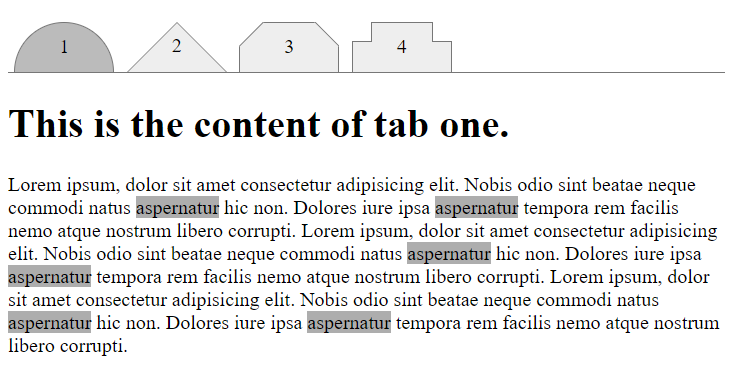

# Тестовое задание

Создайте 4 табы которые загружают содержимое с JSON:
+ https://raw.githubusercontent.com/sellbe/test-task/master/data/1.json
+ https://raw.githubusercontent.com/sellbe/test-task/master/data/2.json
+ https://raw.githubusercontent.com/sellbe/test-task/master/data/3.json
+ https://raw.githubusercontent.com/sellbe/test-task/master/data/4.json

При нажатии на каждую из табов асинхронно загружается содержимое по соответствующему URL.

## Внешний вид табов

## Требования к заданию
+ Без использования изображений 
+ Без сторонних библиотек
+ Предусмотрите, чтобы данные повторно не загружались при переходе на вкладку, которая уже была посещена
